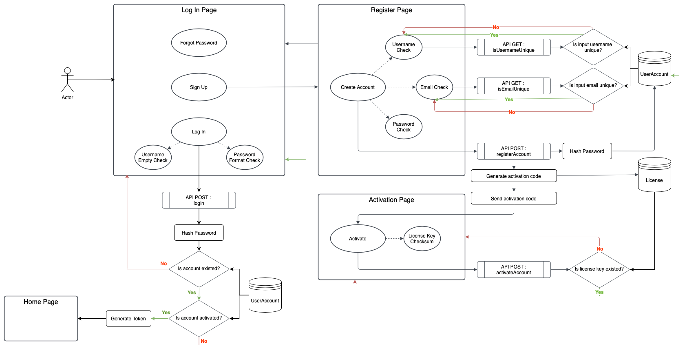
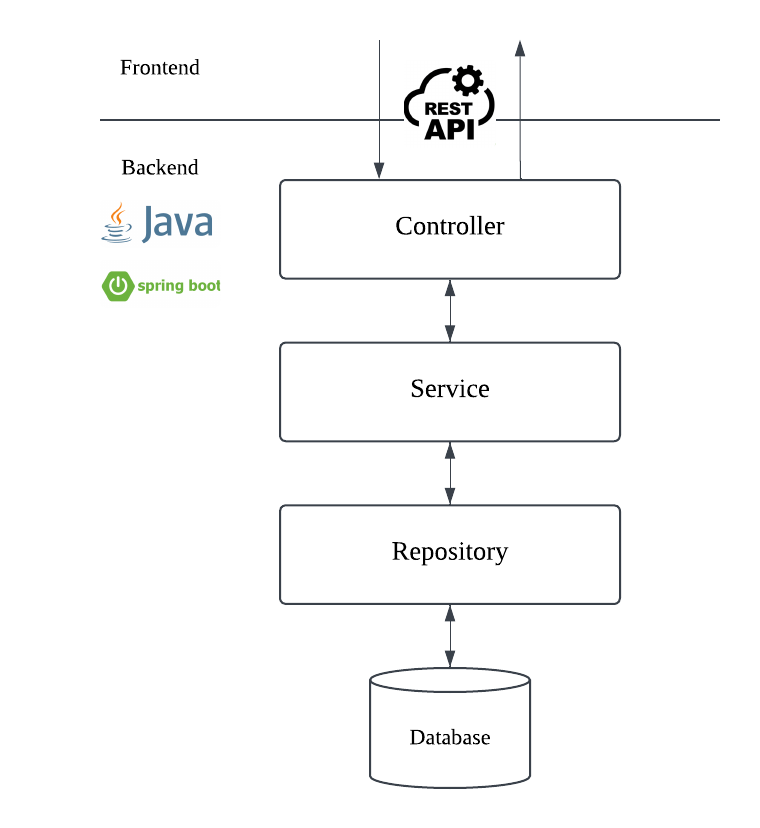

# Backend

## Account Management
For each API requirement, please refer to corresponding issue.

## General Structure
- Work Flow/ : Work flow diagrams
- Database/ : Database schema and SQL code
- src/main/java/project/flowchat/backend/ : Program Source
  - Model/ stores object types that match with database attributes
  - User ResponseBody instead of a new Model Class to create each API

